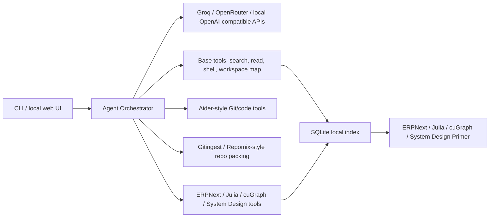

# OSS Agent Workbench

Local-first AI agent powered by the open-source repositories in this workspace.

It is not a SaaS wrapper. It is a provider-agnostic agent shell with:

- OpenAI-compatible provider adapters for Groq, OpenRouter, local servers, and future APIs.
- Active OSS tools over ERPNext, Julia, cuGraph, System Design Primer, and any other folders you add.
- Tool use for repo search, file reading, workspace summaries, and guarded shell execution.
- CLI and browser UI.
- No API keys committed. Add them later in `.env`.

## Active OSS Tools

The agent can now select local OSS tools before answering:

- `erpnext_business_tool`: uses ERPNext for ERP, accounting, inventory, stock, buying, selling, and Frappe workflows.
- `julia_language_tool`: uses Julia for language, runtime, compiler, package, parser, and performance reasoning.
- `cugraph_graph_tool`: uses cuGraph for dependency graphs, ranking, relationship reasoning, centrality, and graph concepts.
- `system_design_tool`: uses System Design Primer for architecture, scaling, caching, queues, reliability, storage, and API design.
- `aider_git_native_tool`: creates Aider-style repository maps for coding workflows.
- `repomix_context_pack_tool`: packs selected files with explicit XML-style boundaries and filters sensitive paths.
- `gitingest_remote_context_tool`: prepares public GitHub URL ingestion into prompt-ready context.
- `last30days_research_tool`: uses the existing Last30days skill repo for research brief and comparison patterns.
- `rich_output_template_tool`: provides Markdown and Mermaid templates for dashboards, diagrams, maps, reports, and boards.

## Workspace Map

Key local agent files:

- `agent_core/router.py`: intent classifier mapping user requests to tool chains.
- `agent_core/context_window.py`: chained tool observation context.
- `agent_core/session.py`: `session_state.json` persistence for ReAct tool context.
- `agent_core/rich_output_template_tool/render.py`: Mermaid validation and normalization helpers.
- `agent_core/react_loop.py`: ReAct planner and tool execution loop.
- `agent_core/oss_tools.py`: active OSS tool registry and tool implementations.
- `agent_core/health.py`: structured platform and per-tool health checks.
- `web/app.js`: chat UI, Markdown/Mermaid rendering, tool workbench, graph panel.

## Agent Tool Process

The agent follows the same structure used by production tool agents:

1. Execution sandbox: local OSS tools run through a read-only sandbox facade today, ready for Docker isolation later.
2. Tool definitions: every OSS tool has a JSON function schema.
3. ReAct loop: the agent records Thought -> Action -> Observation tool steps before the final model answer.

## Prompt Harness

The system prompt is generated dynamically by `agent_core/prompt_harness.py`.

It injects:

- Role and identity
- Workflow rules
- Tool constraints
- JSON tool schemas
- Working directory
- OS
- Current date/time
- Git status
- Sub-agent templates for read-only research and implementation work

Inspect prompt templates at <http://127.0.0.1:8765/api/prompts>.

## Rich Output Templates

The agent has built-in Markdown/Mermaid templates for:

- repository maps
- architecture diagrams
- dependency graphs
- mind maps
- system architecture blocks
- dashboards
- collapsible sections
- Kanban boards
- sequence diagrams
- project analysis reports

Inspect templates at <http://127.0.0.1:8765/api/templates>.

## Health Checks

Run the built-in wiring checks:

```powershell
python -m unittest tests.test_health
```

Inspect live health at <http://127.0.0.1:8765/api/health>.
The health payload includes structured per-tool checks with `tool`, `status`, `latency_ms`, and `last_ok_at`.

Run broader local evals:

```powershell
python -m agent_core.evals
python -m agent_core.evals --provider
```

## Memory

Chat memory is stored locally in SQLite at `data/agent_memory.sqlite3`.

- `GET /api/memory?session_id=...`
- `POST /api/memory/clear`

ReAct tool context is stored in `session_state.json` and pruned to recent tool observations.

## Run Log

Agent run metadata is stored locally in SQLite at `data/run_log.sqlite3`.

- `GET /api/runs?session_id=...`
- `POST /api/runs/clear`

## Tool Workbench

Run individual OSS tools directly:

- UI: sidebar Tool Workbench
- API: `POST /api/tools/run`

```json
{
  "tool": "erpnext_business_tool",
  "query": "stock valuation"
}
```

## Repository Graph

The cuGraph-style graph tool can generate a lightweight workspace dependency graph from imports/includes.

- API: `GET /api/graph`
- Tool query: `cugraph_graph_tool` with `dependency graph`

Frameworks to integrate later:

- LangGraph for stateful graph orchestration.
- CrewAI for multi-agent tool ownership.
- LlamaIndex Workflows for retrieval-heavy routing.

## OSS Agent Blueprints

The next build layer should borrow from these open-source agent/context tools:

- Aider: Git-native coding agent patterns, repository maps, file edits, and commit workflows.
- Gitingest: prompt-ready remote repository ingestion from GitHub URLs.
- Repomix: structured repository packing with XML-style file boundaries and sensitive-file checks.

## Quick Start

```powershell
cd C:\Users\brandon\Desktop\project-source\ai-agent-oss
Copy-Item .env.example .env
python -m agent_core.indexer --rebuild
python -m agent_core.cli "Design an ERP inventory agent that can explain the ERPNext code paths"
python server.py
```

Open <http://127.0.0.1:8765> for the local UI.

## Providers

Set one provider in `.env`:

```env
AGENT_PROVIDER=groq
GROQ_API_KEY=...
GROQ_MODEL=llama-3.3-70b-versatile
```

or:

```env
AGENT_PROVIDER=openrouter
OPENROUTER_API_KEY=...
OPENROUTER_MODEL=meta-llama/llama-3.3-70b-instruct
```

or point to a local OpenAI-compatible server:

```env
AGENT_PROVIDER=local
LOCAL_BASE_URL=http://127.0.0.1:11434/v1
LOCAL_MODEL=llama3.1
```

Without keys, the agent runs in offline mode and uses local retrieval plus tool results.

## Architecture



## Safety Notes

Shell execution is restricted by policy in `agent_core/tools.py`. Expand it deliberately.
Secrets are loaded only from environment variables or `.env`.
