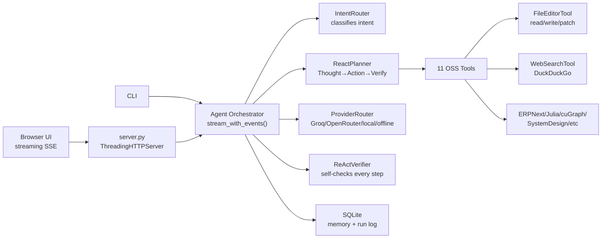

# Midday Workbench

A local-first AI coding agent. No SaaS. No cloud lock-in. Runs on your machine with any OpenAI-compatible provider — or fully offline.

## What it does

- **Streams responses** token by token with a blinking cursor, just like Cursor or Claude Code
- **Writes files** — say "create server.py that does X" and it writes the file automatically
- **Reads files** — provides current file content as context before editing
- **Searches the web** via DuckDuckGo Instant Answers (no API key needed)
- **Runs tools** for ERPNext, Julia, cuGraph, System Design, repo maps, context packing, and research
- **Routes work through specialist skills** for direct replies, visuals, code review, implementation, research, architecture, and provider diagnostics
- **Verifies results** with a self-verifier on every ReAct step
- **Persists sessions** in SQLite — memory and run logs survive restarts
- **Shows operator telemetry** for route drift, provider readiness, command history, quality gates, and control-plane health
- **Zero dependencies** — pure Python stdlib + vanilla HTML/CSS/JS

## Quick Start

```bash
cp .env.example .env
# Add your provider key (Groq, OpenRouter, or local Ollama)
python server.py
```

Open <http://127.0.0.1:8765> in your browser.

## Providers

Set one in `.env`:

```env
# Groq (fastest free tier)
AGENT_PROVIDER=groq
GROQ_API_KEY=gsk_...
GROQ_MODEL=llama-3.3-70b-versatile

# OpenRouter (access to Claude, GPT-4o, Gemini, DeepSeek)
AGENT_PROVIDER=openrouter
OPENROUTER_API_KEY=sk-or-...
OPENROUTER_MODEL=meta-llama/llama-3.3-70b-instruct
PROVIDER_MAX_TOKENS=128
AGENT_CONTEXT_CHAR_BUDGET=6000

# Local Ollama
AGENT_PROVIDER=local
LOCAL_BASE_URL=http://127.0.0.1:11434/v1
LOCAL_MODEL=llama3.1
```

If OpenRouter reports a credit error for `max_tokens`, lower `PROVIDER_MAX_TOKENS` in `.env` to a value your account can afford, such as `128` or `256`.
If the provider reports prompt/context limits, lower `AGENT_CONTEXT_CHAR_BUDGET` to reduce attached repository context.

No keys = offline mode. Local tools and repo context still work.

## Active Tools (11)

| Tool | What it does |
|---|---|
| `file_edit_tool` | Read, write, create, patch files in the workspace |
| `web_search_tool` | DuckDuckGo Instant Answers — no API key |
| `erpnext_business_tool` | ERP, accounting, inventory, Frappe doctypes |
| `julia_language_tool` | Julia language, runtime, compiler reasoning |
| `cugraph_graph_tool` | Dependency graphs, centrality, PageRank |
| `system_design_tool` | Architecture, scaling, caching, queues |
| `aider_git_native_tool` | Git-native repo maps for coding workflows |
| `repomix_context_pack_tool` | XML-boundary repo packing, sensitive-file filtering |
| `gitingest_remote_context_tool` | GitHub URL ingestion into prompt-ready context |
| `last30days_research_tool` | Recent-trend research briefs and comparisons |
| `rich_output_template_tool` | Mermaid/Markdown diagrams, dashboards, Kanban |

## Architecture



## Streaming

The UI uses `fetch` + `ReadableStream` for token-by-token streaming. The server sends standard SSE events:

```
data: {"type": "tool", "tool": "file_edit_tool", "summary": "Read server.py"}
data: {"type": "token", "token": "Here"}
data: {"type": "token", "token": " is"}
data: {"type": "file_written", "path": "server.py"}
data: {"type": "done", "metadata": {...}}
```

## File Editor

**Via agent chat:**
> "Create a file `hello.py` that prints Hello World"

The agent reads the existing file (if any) as context, asks the model to generate new content, extracts the first code block from the response, and writes it automatically.

**Via sidebar panel:**
- Enter any workspace-relative path
- Click **Read** to load content into the editor
- Edit, then click **Write** to save

**Via API:**
```bash
# Read
GET /api/files/read?path=server.py

# Write
POST /api/files/write
{"path": "hello.py", "content": "print('Hello World')"}

# Search-and-replace patch
POST /api/files/patch
{"path": "server.py", "search": "old text", "replace": "new text"}

# List files
GET /api/files/list?pattern=**/*.py
```

Safety: all paths stay within `workspace_root`, sensitive files (`.env`, `*secret*`, `*token*`, `*.key`) are blocked, max 200 KB per write.

## Web Search

```
User: search for Python asyncio best practices
Agent → web_search_tool → DuckDuckGo Instant Answers → summary + related topics
```

No API key. No rate limits beyond DuckDuckGo's anonymous tier.

## API Reference

| Method | Path | Description |
|---|---|---|
| POST | `/api/chat` | Non-streaming chat (full response) |
| POST | `/api/chat/stream` | Streaming SSE chat |
| GET | `/api/status` | Provider route, tools, schemas |
| GET | `/api/health` | Platform + per-tool health checks |
| GET | `/api/control-plane` | Aggregated health, metrics, policy, routing, provider, prompt, and tool state |
| GET | `/api/control-plane?light=1` | Faster control-plane probe without heavy history payloads |
| GET | `/api/skills` | Specialist skill profiles, permissions, focus, and success criteria |
| GET | `/api/runs` | Recent run log |
| GET | `/api/sessions` | All sessions |
| GET | `/api/memory` | Conversation memory |
| GET | `/api/metrics` | Operational metrics and route-decision counters |
| GET | `/api/operational-review` | Scorecard with risks and recommendations |
| GET | `/api/timeline` | Unified run, command, file, and decision activity |
| GET | `/api/decisions` | Recent policy and route decisions |
| GET | `/api/decisions/routes` | Route-decision summary with drift/review examples |
| GET | `/api/routing-audit` | Deterministic routing contract audit |
| GET | `/api/quality/history` | Persisted quality gate history |
| GET | `/api/graph` | Workspace dependency graph |
| GET | `/api/files/read` | Read a workspace file |
| POST | `/api/files/write` | Write a workspace file |
| POST | `/api/files/patch` | Search-and-replace in a file |
| GET | `/api/files/list` | List files by glob pattern |
| POST | `/api/tools/run` | Run any tool directly |
| POST | `/api/sandbox/run` | Run an allowed shell command |
| POST | `/api/quality/run` | Run required quality gates through the sandbox |

## Health Checks

```bash
python -m pytest tests/ -v
```

Or inspect live at <http://127.0.0.1:8765/api/health>.

## Memory & Sessions

- Chat memory: `data/agent_memory.sqlite3`
- Run log: `data/run_log.sqlite3`
- Session IDs: stored in `localStorage` in the browser

## ReAct Loop

Every non-trivial request goes through:

```
User prompt
  → IntentRouter classifies intent
  → ReactPlanner selects tools
  → Tool runs (file_edit, web_search, oss_tool, etc.)
  → ReActVerifier checks the result
  → ProviderRouter streams model answer
  → Auto file-write (if file_edit_tool was used)
  → AgentRun saved to SQLite
```

## Keyboard Shortcuts

| Shortcut | Action |
|---|---|
| `Ctrl+Enter` / `Cmd+Enter` | Submit prompt |

## What to build next

Good next layers for a Codex agent or contributor:

- **Multi-file edits** — edit several files in one request using a diff/patch format
- **Git commit tool** — after file edits, stage + commit automatically
- **Test runner tool** — run pytest/jest after changes and feed failures back into the loop
- **Browser preview** — open a subprocess and show the running app
- **Multi-agent** — planner agent spawns sub-agents per file edit
- **Vector search** — replace SQLite FTS with embeddings for better context retrieval
- **MCP server** — expose tools over Model Context Protocol so Claude Desktop can use them
- **Docker sandbox** — move shell execution from read-only into a contained Docker container
- **Cost tracking** — log tokens and compute cost per run

## Safety

- Shell commands go through an explicit allowlist in `agent_core/sandbox.py`
- The command runner previews allow/block status before execution
- Common health commands such as `python -m unittest`, `python -m agent_core.evals`, `python -m agent_core.secret_scan`, `node --check`, `pytest`, `npm test`, and `npm run build` are allowed
- Install, network, destructive, chained, redirected, and privilege-escalation commands are blocked
- File writes are blocked for `.env`, `*secret*`, `*token*`, `*credential*`, `*.key`, `*.pem`
- Max file write: 200 KB
- No secrets committed — use `.env` (gitignored)
